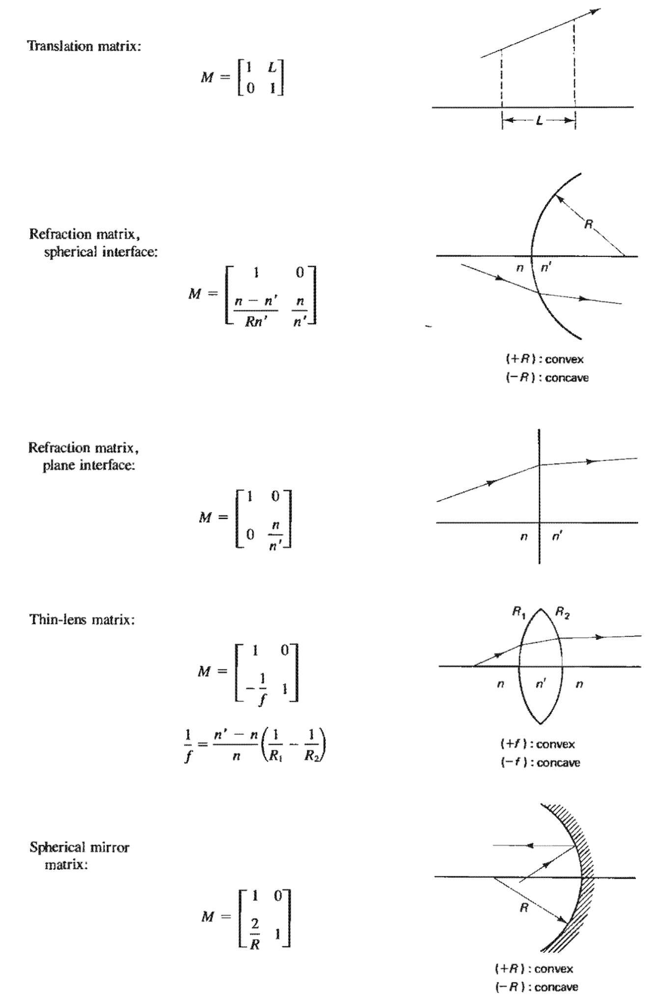
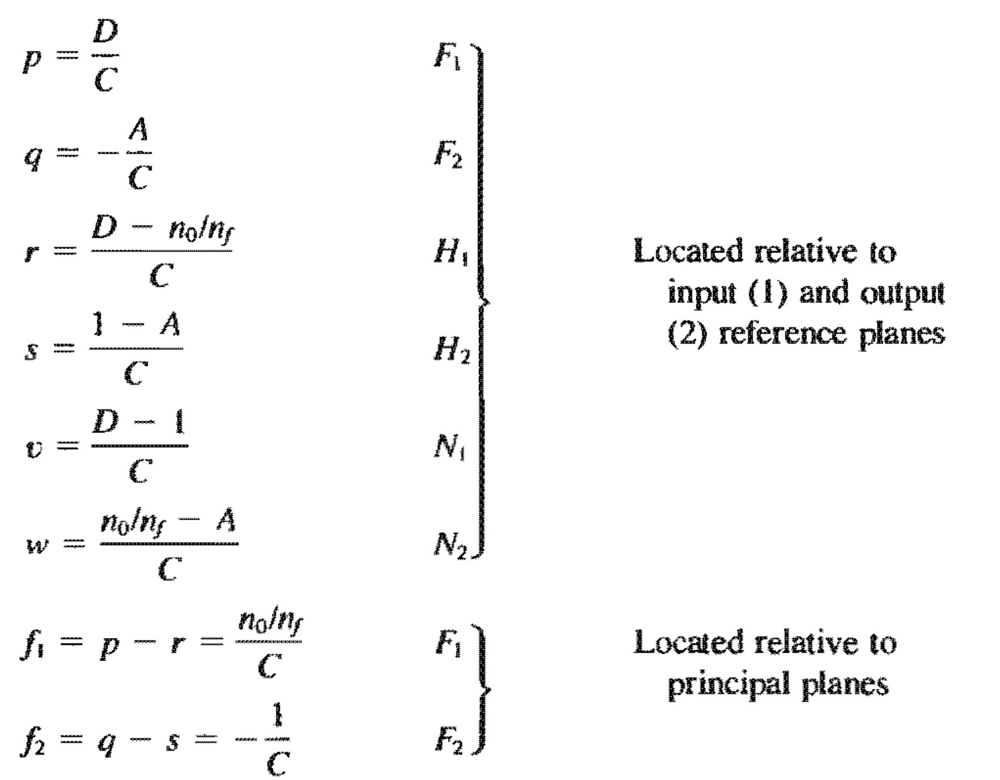
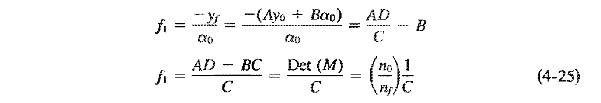

# Optics

[ToC]

## Geometrical opticss
#### Snell's law
$$
n_i \sin\theta_i = n_t \sin\theta_t
$$

#### Refraction plane surfaces
$$
s' = s \frac{n_2}{n_1}
$$

#### Refraction spherical surfaces
$$
\frac{n_1}{s} + \frac{n_2}{s'} = \frac{n_2 - n_1}{R}
$$

$$
m = -\frac{n_1 s'}{n_2 s}
$$

#### Thin lens
$$
\begin{align*}
\frac{1}{f} &= \frac{n_2 - n_1}{n_1}\Big (\frac{1}{R_1} - \frac{1}{R_2}\Big) \\
&=\frac{1}{s} + \frac{1}{s'}
\end{align*}
$$

#### Power
$$
\begin{align*}
P&=\frac{1}{f} \\
&=\sum_{i=1}^n\frac{1}{f_i}
\end{align*}
$$

### Matrix methods
___

#### Ray-transfer matrices

#### Cardinal points

### Optical instrumentation (ork)
___

#### Camera
Circular opening with diameter $D$, image radius $d$, and focal length $f$:
$$
\begin{align*}
E_e &\propto \frac{D^2}{d^2} \\
&\propto \frac{1}{A^2}, & A\equiv\frac{f}{D} \text{ relative opening}
\end{align*}
$$

#### Magnifying glass
Near point of normal eye is $25$ cm.

Angular magnification at infinity:
$$M=\frac{25}{f}$$

At near point:
$$M=\frac{25}{f} + 1$$

Two lenses at a distance L from each other:
$$\frac{1}{f} = \frac{1}{f_1} + \frac{1}{f_2} - \frac{L}{f_1 f_2}$$

If the system is independent of the refracting index:

$$L=\frac{1}{2}\big(f_1 + f_2\big)$$

#### Microscopes

Objective and eyepiece focal lenghts $f_o$ and $f_e$, with a distance $d$ between the lenses. 

$$
M=25\ \frac{f_e + f_o - d}{f_o\ f_e}
$$

#### Telescopes
Exit and objective diameter $D_{ex}$ and $D_{obj}$
$$
\begin{align*}
M&=-\frac{f_o}{f_e} \\
&=\frac{D_{obj}}{D_{ex}}
\end{align*}
$$

### ¿Holography?
___

## Wave optics

$E = c B$

$u_E = \frac{1}{2} \epsilon E^2$

$u_B = \frac{1}{2} \frac{1}{\mu} B^2$

$u_E=E_B$

$u = u_E + u_B = \epsilon c E B$

$\vec{S} = \epsilon_0 c^2 \vec{E} \times \vec{B}$

$E_e = \langle \|\vec{S}\|\rangle = \frac{1}{2} \epsilon c^2 E_0 B_0$

### Fresnell Equations
___
$$
\begin{align*}
r_{TE}&=\frac{\cos\theta - n \cos\theta_t}{\cos\theta + n \cos\theta_t} 
&t_{TE} = 1 + r_{TE} \\
&=\frac{\cos\theta - \sqrt{n^2 - \sin^2\theta}}{\cos\theta + \sqrt{n^2 - \sin^2\theta}} \\
\\
r_{TM} &= \frac{\cos\theta_t - n \cos\theta}{\cos\theta_t + n \cos\theta} 
& n\ t_{TM} = 1 - r_{TM} \\ 
&= -\frac{n^2\cos\theta - \sqrt{n^2 - \sin^2\theta}}{n^2\cos\theta + \sqrt{n^2 - \sin^2\theta}}
\end{align*}
$$

$r_{TM} = 0 \Rightarrow \theta = \theta_p=\arctan n$

#### External reflection
$n = \frac{n_2}{n_1} > 1$

$\phi_{TE}=\pi$
$\phi_{TM}=-\pi, \ \ \ \ \theta < \theta_p$
$\phi_{TM}=0, \ \ \ \ \ \ \ \theta > \theta_p$

#### Internal reflection
$\theta_c = \arcsin n$

$\theta > \theta_c:$

$$
\begin{align*}
\tan{\frac{\phi_{TE}}{2}} &= - \frac{\sqrt{\sin^2\theta - n^2}}{\cos\theta} \\
\tan{\frac{\phi_{TM}}{2}} &= - \frac{\sqrt{\sin^2\theta - n^2}}{n^2\cos\theta}
\end{align*}
$$

$\theta \in (\theta'_p, \theta_c):$
$$
\phi_{TM}=\pi
$$
Otherwise:
$$
\phi = 0
$$

#### Reflectance and Transmittance
$R=\frac{P_r}{P_i}=r^2=\frac{E_r^2}{E^2}$
$T=\frac{P_t}{P_i}=n \frac{\cos\theta_t}{\cos\theta} t^2$
$T + R = 1$

### Interference
___

$I = \epsilon_0 c \big\langle\vec{E}^2\big\rangle=\frac{1}{2}\epsilon_0 c E_0^2$

$\vec{E_i}=\vec{E_{0i}} \cos(k s_i - \omega t + \phi_i)$

$\vec{E_p} = \vec{E_1} + \vec{E_2}$

$I=I_1 + I_2 + 2 \sqrt{I_1 I_2} \langle\cos\delta\rangle, \ \ \ \ \delta=k(s_2 - s_2) + \phi_2 - \phi_1$

**Fringe contrast/visibility**

$\frac{I_{max} - I_{min}}{I_{max}+I_{min}}$

#### Young's double slit
Point source $\Rightarrow$ same phase, propagation, etc.

$I = 4 I_0 \cos^2\frac{\delta}{2}$

**Constructive:**

$\Delta s = s_2-s_1 = m \lambda \approx a \sin\theta$

**Destructive:**

$\Delta s = \big(\frac{1}{2} + m\big) \lambda \approx a \sin\theta$

#### Resultant waves
$E_i = E_{0i} \cos(\alpha_i - \omega t)$

$$
\begin{align*}
E_r=\sum_i E_i & = E_0 \cos(\alpha - \omega t), \\
\tan\alpha &= \frac{\sum_i E_{0i} \sin\alpha_i}{\sum_i E_{0i} \cos\alpha_i}\\
E_0^2 &= \Big(\sum_i E_{0i} \sin\alpha_i\Big)^2 + \Big(\sum_i E_{0i} \cos\alpha_i\Big)^2 \\
&=\sum_i E_{0i}^2 + 2\sum_i \sum_{j > i} E_{0i} E_{0j} \cos(\alpha_i - \alpha_j)
\end{align*}
$$

#####Random sources

$N$ randomly phased sources of equal amplitude, $N$ grows large:
$$
E_0^2 = \sum_{i=1}^N E_{0i}^2 = N E_{01}^2
$$

#####Coherent sources

$N$ coherent sources:
$$
E_0^2 = \sum_{i=1}^N E_{0i}^2 + 2\sum_{i=1}^N \sum_{j > i}^N E_{0i} E_{0j}
$$

$N$ coherent sourcces of equal amplitude:
$$
E_0^2 = N^2E_{01}^2
$$

##### Standing waves

$E_1=E_0 \sin(\omega t + kx)$

$E_2=E_0\sin(\omega t - kx - \phi_r)$

$$
\begin{align*}
E_R &= E_1 + E_2\\
&=2 E_0 \cos\Big(k x + \frac{\phi}{2}\Big) \sin\Big(\omega t - \frac{\phi_R}{2}\Big)
\end{align*}
$$

Beat frequency $\omega_b=2\ \omega_g$

##### Beats
$E_i = E_0 \cos(k_i x - \omega_i t)$

$$
\begin{align*}
E_R &= E_1 + E_2\\
&=2 E_0 \cos(k_p x + \omega_p t) \cos(k_g x - \omega_g t)
\end{align*}
$$
$$
\begin{align*}
\omega_p &= \frac{\omega_1 + \omega_2}{2}, &k_p=\frac{k_1 + k_2}{2} \\
\omega_g &= \frac{\omega_1 - \omega_2}{2}, &k_g=\frac{k_1 - k_2}{2}
\end{align*}
$$

#### Dispersion

$$
\begin{align*}
v_p &= \frac{c}{n} \\
v_g=\frac{dw}{dk}&=v_p\big(1 + \frac{\lambda}{n} \frac{dn}{d\lambda}\big)\\
&=v_p - \lambda \frac{dv_p}{d\lambda} \\
&=v_p\Big(1 - \frac{\omega}{n}\frac{dn}{d\omega}\Big)
\end{align*}
$$

Medium of normal dispersion $\Rightarrow \frac{dn}{d\lambda} < 0$

#### Michelson interferometer

$2\ d \cos\theta = m\ \lambda$

Mirror translation $\Delta d$ and $\Delta m$ fringes passing a point:

$$\Delta m = \frac{2\Delta d}{\lambda}$$

Center dark spot:

$$m_{max}=\frac{2d}{\lambda}$$

#### Dielectric films

Equal internal and external reflection:

$\frac{n_f}{n_0}=\frac{n_s}{n_f} \Rightarrow n_f=\sqrt{n_0 n_s}$

### Fiber optics
___

$$
\begin{align*}
\vec{E} &= \vec{E}(x) e^{\beta z - \omega t} \\
\vec{B} &= \vec{B}(x) e^{\beta z - \omega t}
\end{align*}
$$

Satisfying maxwell's equations:
$$
\begin{align*}
\text{TE:} && \frac{\partial^2E_y}{\partial x^2}(x)&=\Big[\beta^2 - k^2(x)\Big] E_y(x) \\
\text{TM:} && \frac{\partial^2B_y}{\partial x^2}(x)&=\Big[\beta^2 - k^2(x)\Big] B_y(x) \\
\end{align*}
$$

Implies relative refractive index $N$ satisfying

$$
\begin{align*}
\text{TE:} && \frac{\omega b}{c}\sqrt{n_1^2 - N^2}&=2 \arctan\sqrt{\frac{N^2 - n_2^2}{n_1^2 - N^2}} + m\pi \\
\text{TM:} && \frac{\omega b}{c}\sqrt{n_1^2 - N^2}&=2 \arctan\Big(\frac{n_1^2}{n_2^2}\sqrt{\frac{N^2 - n_2^2}{n_1^2 - N^2}}\Big) + m\pi \\\end{align*}
$$
for $m\in\mathbb{N}$.

### Evanescent Waves
___
Light penetration of $y$ into medium when $\theta > \theta_c$:
$$
E_t = E_{0t} \exp\Big(i x k_t \frac{\sin\theta}{n}\Big) \exp\Big(- i \omega t\Big)\exp\Big(- \alpha y\Big)
\\ \\
\alpha \equiv k_t \sqrt{\frac{\sin^2\theta}{n^2} - 1}
$$

### Coherence
___
#### Temporal/longitudinal coherence lenght
$$l_c=\frac{2\pi c}{\Delta f}$$
Coherent time and frequency bandwidth:
$$
\begin{align*}
\tau_c=\frac{l_c}{c}, & &  \Delta f = \frac{1}{\tau_c}
\end{align*}
$$
Uniform wavelength distribution around $\lambda$ with linewidth $\Delta\lambda$:
$$l_c=\frac{\lambda^2}{\Delta\lambda}$$

#### Spacial coherence
Rectangular source of width $s$ and angluar width $\phi$:
$$l_s=\frac{r \lambda}{s}\approx\frac{\lambda}{\phi}$$
Circular source of diameter $s$:
$$l_s=1.22\frac{r\lambda}{s}\approx1.22\frac{\lambda}{\phi}$$

#### Visibility
The intensity at a point $P$
$$
I_P = I_{1P} + I_{2P} + 2 \sqrt{I_{1P} I_{2P}} \Re(\gamma(\tau))
$$
with the normalized correlation function
$$
\gamma(\tau) = \Big(1 - \frac{\tau}{\tau_0}\Big)e^{i\omega\tau}
$$

With equal beams, we get
$$
\begin{matrix}
\text{Complete incoherence} & & \tau\to\tau_0 & V=0 \\
\text{Complete coherence} & & \tau = 0 & V=1 \\
\text{Partial coherence} & & 0 < \tau < \tau_0 & V=|\gamma(\tau)|
\end{matrix}
$$

### Diffraction
___

#### Fraunhoffer diffraction
Single rectangular slit, **length much larger than width**:
$$
\begin{align*}
dE_p&=\frac{E_L ds}{r} e^{i(kr-\omega t)} \approx \frac{E_L ds}{r_0} e^{i(kr_0-\omega t)}e^{ik\Delta r}, && \Delta r=s \sin\theta \\
E_p&=\frac{E_l b}{r_0} \text{sinc}\beta\ e^{i(k r_0 - \omega t)}, && \beta=\frac{1}{2} k b \sin\theta \\
I&=I_0\text{sinc}^2\beta, && I_0=\frac{1}{2}\epsilon_0 c \Big(\frac{E_l b}{r_0}\Big)^2
\end{align*}
$$

Many slits:

$$I=I_0 \text{sinc}^2\beta\ \frac{\sin^2(N \alpha)}{\sin^2\alpha}$$

Rectangular slit:

$$I=I_0\text{sinc}^2\beta\ \text{sinc}^2\alpha$$

Circular slit
$$
\begin{align*}
I = I_0\Big(\frac{2 J_1(\gamma)}{\gamma}\Big)^2, && \gamma = \frac{1}{2} k\ D\sin\theta \\
&& J_1(\gamma)=\sum_{l=0}^\infty \frac{(-1)^l}{2^{l+1}l!(l+1)!}\gamma^{2l + 1}
\end{align*}
$$
[Zeros of bessel functions and their derivatives](https://mathworld.wolfram.com/BesselFunctionZeros.html)

##### Beam spreading
Width $W$ of central maximum at a distance $L$:
$$W=L \Delta \theta = \frac{2L\lambda}{b}$$

##### Resolution
(Sircular aperture) 
Rayleigh's criterion:
$$(\Delta\theta)_{min}=\frac{1.22\lambda}{D}$$

#### Diffraction grating

Grating width $a$

Optical path difference:
$$\Delta d = a (\sin\theta_i + \sin\theta_m)$$

